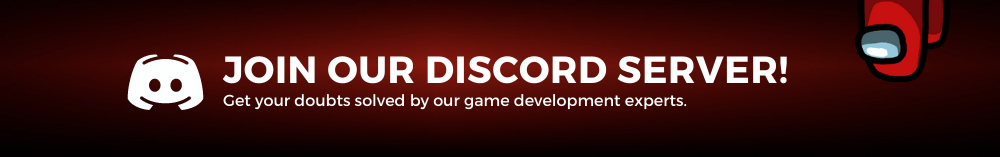

# **MVC & Design Patterns in Unity** 

<aside>

> 💡 **What you will learn after the course**
> - [What is Design Pattern?](#what-is-design-pattern)
> - [What is MVC?](#what-is-mvc-&-how-does-it-work)
> - [Problems that MVC is Solving](#problems-that-mvc-is-solving)
> - [Advantage/Disadvantage](#advantage/disadvantage)
> - [Implementation of MVC in real games](#implementation-example-of-mvc-in-real-game-development)

🚀 **[Join Discord Server](https://discord.gg/J5zDscnzms)**

</aside>

---

<aside>

> 💡 Start your game dev journey by sharing with the world and start earning reward points. 
Outscal team will give **a** **special surprise reward** to those who successfully complete this **#30DaysGameDevChallenge**
> 1. Log in to LinkedIn.
> 2. Create a post.
> 3. Share a short post that you are starting the second chapter of your game development journey with below hashtags.
> 4. Tag Outscal and your newly made connections in the post so the team will get notified every time. Use **#30DaysGameDevChallenge and #outscal** in the post.
> **final step.** Submit the LinkedIn post link via this form [https://airtable.com/shrXGSkgf5NClpoIU](https://airtable.com/shrXGSkgf5NClpoIU)

</aside>

<aside>

> 💡 In this chapter, you can create two submissions.
> 1. submission = 50 points
> 2. submissions = 100 points
>> 500 points = Outscal Branded T-shirt 👕

</aside>

--- 

# 1. What is a Design Pattern

Design **pattern stands for a programming concept that solves conceptual problems. It can be related to creating new objects, making the code more independent or modular, or even splitting your project into different layers of responsibility

<aside>
💡 🚀 **[Join Discord Server](https://discord.gg/J5zDscnzms) → Get your doubts solved by experts instantly**

</aside>

---

# 2. What is MVC & how does it work

MVC design pattern introduces another abstraction layer that will help with the software planning, and also allow new programmers to navigate even in a bigger codebase. By splitting the thinking process into data, interface, and decisions, developers can reduce the number of source files that must be searched in order to add or fix functionality.

    

This design pattern separates code into three layers as the name suggests. 

- Model
    - job: stores game map, player and NPC data, game settings. Everything data.
    - is not aware of what Views or Controllers are looking at it.
    - can post and listen for events.
- View
    - job: draws on screen what the model represents.
    - is strongly aware of the model and its values.
    - can post and listen for events.
- Controller
    - job: taking keyboard and mouse input and posts matching events.
    - is strongly aware of the model and its values.
    - can post and listen for events.
- Events
    - job: coordinates messages between listeners.

    

This shows that even if the Controller does not know anything about the player's health, what level we are on, it still only catches key presses and sends out events to match.

Nor does the View care how the player is controlling our game. The View only cares about showing on screen the current model state. Since the View also listens to posted events, it will pick up mouse clicks and key presses that integrate into its widgets.

<aside>

> 💡 🚀 **[Join Discord Server](https://discord.gg/J5zDscnzms) → Get your doubts solved by experts instantly**

</aside>

---

# 3. Problems that MVC is solving

Without structure, your code can get messy very easily and look like “spaghetti code”. To avoid this, developers should separate the game logic from the display code

The MVC pattern helps you break up the frontend and backend code into separate components. Allows multiple game developers need to update, modify, or debug a full-blown application simultaneously. 

<aside>

> 💡 🚀 **[Join Discord Server](https://discord.gg/J5zDscnzms) → Get your doubts solved by experts instantly**

</aside>

---

# 4. Advantage/Disadvantage

Pros:

- Simultaneous development — Multiple developers can work simultaneously on the model, controller, and views.
- High Cohesion: MVC enables the logical grouping of related actions on a controller together. The views for a specific model are also grouped together.
- Low Coupling — The very nature of the MVC framework is such that there is low coupling among models, views, or controllers.
- Ease of modification — Because of the separation of responsibilities, future development or modification is easier i.e. scalability of the product is increased.
- Multiple views for a model — Models can have multiple views.

Cons

- Code navigability — The framework navigation can be complex because it introduces new layers of abstraction and requires users to adapt to the decomposition criteria of MVC.
- Multiple Representations — Decomposing a feature into three artefacts causes scattering. Thus, requiring developers to maintain the consistency of multiple representations at once.

<aside>

> 💡 🚀 **[Join Discord Server](https://discord.gg/J5zDscnzms) → Get your doubts solved by experts instantly**

</aside>

---

## Implementation Example of MVC in Real Game Development

---

### 1. Game Example: Battle Tank

### 2. Objective: Move the player tank across the map with the help of keyboard/touch inputs

Below we will show you how to make out tank move across the map with the help of MVC Implementation:

Before Jumping on to the game code example, We would like to revise the concepts of MVC via the below snippet:

    

Let’s Begin with the code implementation starting by writing the logic for the movement in Controller script,

## 1. Controller

1. It will be responsible for storing the business logic for moving the tank
2. It will also contain the references of Model and View so that the program of the player tank can easily communicate with each other

    

In the above we can observe the following:

1. Getter and Setter methods of Tank Model and Tank View script will be called in this script
2. The logic for moving and rotating the tank (to certain degrees) is given here.
    
    
    <aside>
    
    > 💡 🚀 **[Join Discord Server](https://discord.gg/J5zDscnzms) → Get your doubts solved by experts instantly**
    
    </aside>
    
    ## 2. View
    
3. TankView will always be a MonoBehavior class.
4. This script will have all the details about all the visible components in our game system like tanks, bullets, enemies, random power Ups, collectables, etc.

    

In the above we can observe the following:

1. Reference of Controller is given here
2. Tank movement logic which was defined in the controller and the same functions are called in the View script’s FixedUpdate (for Physics Calculations) as it is the only class with MonoBehaviour

## 3. Model

1. It will contain all the data variables that our Tank might need such as health, speed, colour, Turn speed of our Tank, etc.

    

In the above we can observe the following:

1. Data components included that will be used by our PlayerTank
2. All the components are declared with a getter and setter here to be used in other scripts

<aside>

> 💡 🚀 **[Join Discord Server](https://discord.gg/J5zDscnzms) → Get your doubts solved by experts instantly**

</aside>

### Things to keep in mind while working with MVC

1. Only View script will be Monobehavior class and the data will start executing from here because it gives permission to write void start and void update methods
2. In the Model script, we will fetch all the data. This data will then be passed to the Monobehavior class in View and the Controller script will take the decision here.

<aside>

> 💡 Now you reached the end of chapter one. Now share with the world and start earning reward points. 

step 1. Log in to LinkedIn.
step 2. Create a post.
step 3. Share a short post that you are starting the second chapter of your game development journey with the below hashtags.
step 4. Tag Outscal and your newly made connections in the post so the team will get notified every time. Use **#30DaysGameDevChallenge and #outscal** in the post.
step 5. Submit the LinkedIn post link via this form [https://airtable.com/shrXGSkgf5NClpoIU](https://airtable.com/shrXGSkgf5NClpoIU)

</aside>

<aside>

> 💡 In this chapter, you can create two submissions.
> 1. submission = 50 points
> 2. submissions = 100 points
>> 500 points = Outscal Branded T-shirt 👕

</aside>

<aside>

> 💡 **⏭ Next Chapter - Project → Super Jumper (coming soon)**

</aside>

---