# **Getting Started with Unity2D**

<aside>

💡 **What you will learn after the course**

---

- [How to Install Unity](#installation)
- [About Unity](#about-unity)
- [Layout](#layout)
- [Toolbar and Navigation in Unity Editor](#toolbar-and-navigation-in-unity-editor)
- [Scene view](#scene-view)
- [Game view](#game-view)
- [Hierarchy](#hierarchy)
- [Project Panel](#project-panel)
- [Console](#console)
- [Components](#components)
- [Inspector](#inspector)

🚀 **[Join Discord Server](https://discord.gg/J5zDscnzms)**

---
</aside>

---
<aside>

> 💡 Start your game dev journey by sharing with the world and start earning reward points. 
> Outscal team will give **a** **special surprise reward** to those who successfully complete this **#30DaysGameDevChallenge**
> 1. Log in to LinkedIn.
> 2. Create a post.
> 3. Start with a post a short update on LinkedIn about, which is your favorite game that you would like to recreate after learning game development.
> 4. Tag Outscal and your newly made connections in the post so the team will get notified every time. Use **#30DaysGameDevChallenge and #outscal** in the post.
> 5. Submit the LinkedIn post link via this form [https://airtable.com/shrXGSkgf5NClpoIU](https://airtable.com/shrXGSkgf5NClpoIU)

</aside>

---
 

<aside>

> 💡 In this chapter, you can create two submissions.
> 1. submission = 50 points
> 2. submissions = 100 points
>> 500 points = Outscal Branded T-shirt 👕

</aside>

---

# 1. Installation                                                                        

- Download *Unity Hub* from the given link 👉 [https://unity3d.com/get-unity/download](https://unity3d.com/get-unity/download)
    
    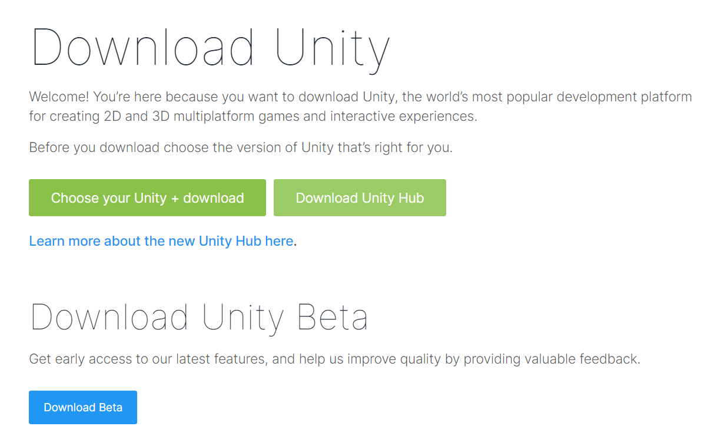
    
- Install the Unity Hub Setup
- After Installation, Go to the **Installs** tab on the left of the Unity Hub.
- Click the **Install Editor** button on the top right.
    
    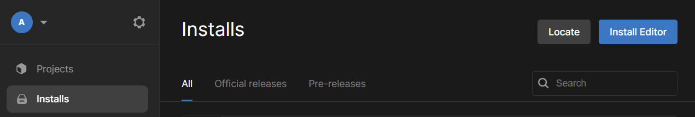
    

  

- Choose one of the **Long Term Support (LTS) versions** to install in your system. LTS versions are bug-free and the team behind the unity supports the software by updating, patching, and maintaining it throughout the lifetime.
    
    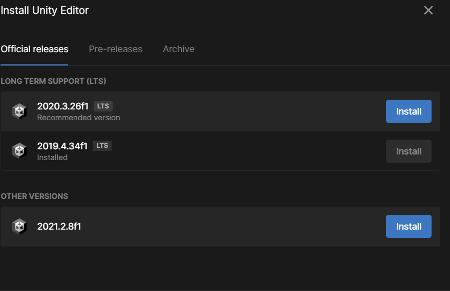
    
- Check ☑️ the **Microsoft Visual Studio Community** for Dev Tools and **Documentation.**
- *Don’t Worry!!* You can add all the build modules later on as per your project requirements.
- Click *Install* and boooommmmm🔥!!! Your Unity Installation is done.

<aside>

> 💡 🚀 **[Join Discord Server](https://discord.gg/J5zDscnzms) → Get your doubts solved by experts instantly**

</aside>

---

# 2. About Unity

*Entity Component System (ECS)* is the main concept that goes behind working with Unity Game Engine. But what is Entity Component System? Got Confused??😕 Let’s divide ECS into three parts-: 👇

- **Entity** → Entities are nothing but *game objects*. *Game Objects* are the objects that you see in a game. Say, you are playing “Super Mario”. You are the player(*Mario character)* through which you interact to kill the enemy (*a turtle*). In this scenario, both the Mario player and the enemy are game objects. The *red-brick* platform through which Mario and its enemies are moving is also a game object. In other words, each and every object that you see in a game is actually a game object *(Entity)*.
    
    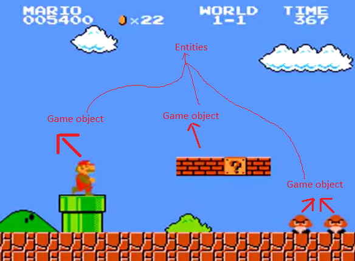
    
- **Component** → Components refer to the *properties* of entities. Properties can be anything, a game object’s height, position, color, or any data that represents it.
- **System** → It is the logic by which you can manipulate the values of the *components.* Suppose you want to change the height of an entity while playing the game. In “Super Mario”, the height of the main player (the entity) changes while achieving some bonus points. You can do all of such manipulation with the help of some logic. That logical process is what the S*ystem* refers to.

<aside>

> 💡 🚀 **[Join Discord Server](https://discord.gg/J5zDscnzms) → Get your doubts solved by experts instantly**

</aside>

---

# 3. Layout

When you open Unity first time, it is easy to get confused with all the windows and tools that show up. As such, Unity allows you to customize this layout to your liking and use those Views only that are currently required. Click-dragging any tab of any view helps us to move and position the View where we want it to be, we can also detach the Window from the Editor if we want. For eg, the Hierarchy Window is being click-dragged :

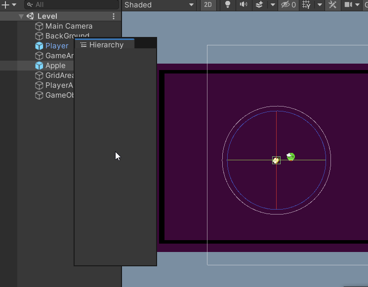

*The Project Panel* has been dragged and attached beside the Hierarchy tab in the picture below: 

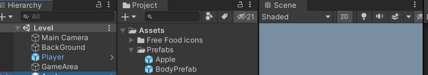

*The Hierarchy tab* has been completely detached from the Editor and can be used just like this as shown below, which can now be said to be a “Floating Editor Window”: 

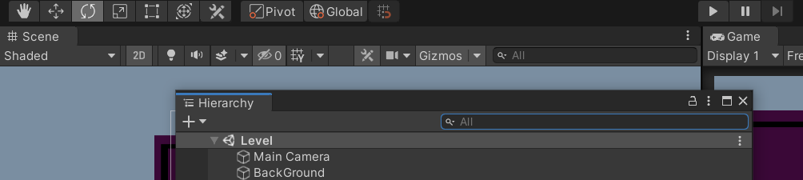

Note:🔴

- A View can have multiple tabs, in which case these tabs can be shown only one at a time, for eg, below, we can see Hierarchy and Project tabs in the same view, in this case, we can open up either the Project Tab or Hierarchy tab only one at a time, of course, tabs can be shifted elsewhere as shown above if they need to be viewed simultaneously.
    
    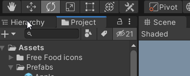
    
- Whenever you are working in tabbed views, the “active” tab (the tab that has focus) has a thin blue stripe at the top, like in the above screenshot, you can see the Project tab having a thin blue stripe
- When multiple tabs are attached to a view that takes up more space than provided, Unity provided small directional arrows to look at the tabs that aren’t visible, for eg, below you can see 3 tabs in one view, but the Project tab isn’t visible, hence click on the arrow to show up :
    
    
    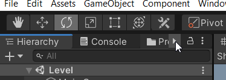
    

- At any time, right-click can be used on a tab to show up the different options specific to it, for eg, the below is shown for the Console tab:
    
    
    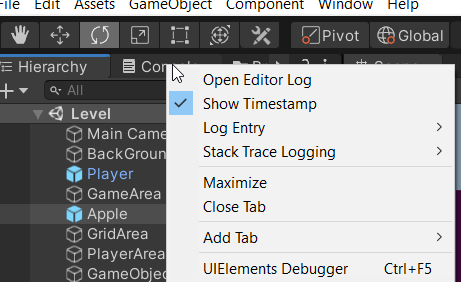
    

- Finally, once you have decided on your own layout of the editor with required tabs and views, you also have the option to save the layout using the *Layout* options found under the layout dropdown (top right corner of Editor), then you can quickly switch back to your saved layouts if any changes are made to the current layout at any point:
    
    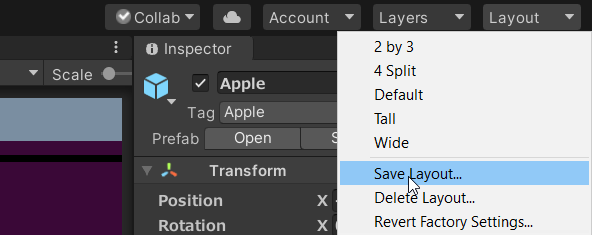
    

<aside>

> 💡 🚀 **[Join Discord Server](https://discord.gg/J5zDscnzms) → Get your doubts solved by experts instantly**

</aside>

---

# 4. Toolbar and Navigation in Unity Editor

The Toolbar at the top of the Editor helps in navigating around the scene view and positioning or moving GameObjects.

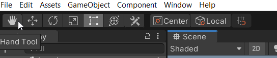

- Pan – hold the Alt key and click-drag with the middle mouse. Also, hold Alt+Ctrl and click and drag
Zoom: Zoom in and out of scene view, hold the Alt key, and right-click and drag
- Rotate – To rotate in the scene view, hold the Alt key and click and Drag
- Hand tool (Hotkey Q) – Allows you to click and drag around in Scene view
- Move tool (Hotkey W) – Move the object in the scene view. Also, click and drag on the arrow pointing along the desired axis
- Rotate tool (Hotkey E) – Rotate the objects in the Scene view. Click and drag on the axis you wish to rotate along
- Scale tool (Hotkey R) – Increase or decrease the size of objects. Click and drag on the cube at the end of the axis you wish to scale. The white center cube allows you to scale on all axes at once uniformly. 
The same functionality can be achieved by manually entering the respective values under Transform in the Inspector for any object

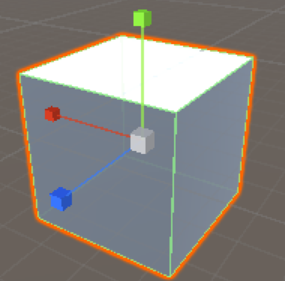

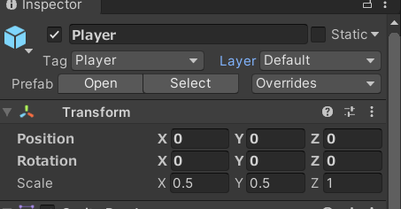

- Rect Transform tool (Hotkey T) – This tool is a combination of the Move, Rotate and Scale tools

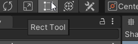

- Transform tool (Hotkey Y) – Works as a combination of all the previous tools (except for Rect Transform)

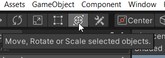

- Handle Rotation – Switch between Local and Global. When set to local, the tool will be rotated based on the selected Object’s relative rotation. When set to Global the tool will always be aligned to global rotations

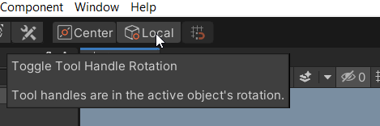

- Custom Editor tools – Displays any custom editor tools that have been added to the Project

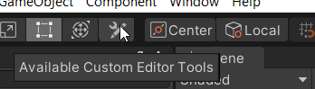

- Center or Pivot – Changes where the tool gizmo appears on the object, this only changes if the GameObject has a custom pivot point
- Toggle Grid Snapping – Only available when the handle rotation is set to Global, this allows snapping the movement of objects in the Editor
    
    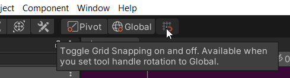
    
    Top Right corner dropdowns: 
    
- Collab – Launch Unity Collaborate
    
    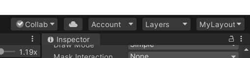
    
- Cloud icon opens the Unity Services Window
- *Account* lets you access your Unity account
- *Layers* option lets you control what objects appear in the scene view
- *MyLayout* lets you change the arrangement of Views/Tabs in your Editor

<aside>

> 💡 🚀 **[Join Discord Server](https://discord.gg/J5zDscnzms) → Get your doubts solved by experts instantly**

</aside>

---

# 5. Scene View

- The **Scene View** is where you can interact with the game objects visually. You can manipulate, select and modify the game GameObjects as per your project requirements. The Scene view can show a 3D or 2D perspective, depending on the type of project.
- Use all the *ToolBar* options in the **scene view** to interact with the game objects.
    
    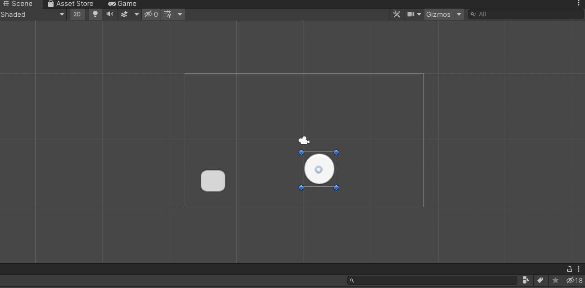
    

<aside> 

> 💡 🚀 **[Join Discord Server](https://discord.gg/J5zDscnzms) → Get your doubts solved by experts instantly**

</aside>

---

# 6. Game View

- The *game view* represents the final published application where all the game objects from the scene view get displayed.
    
    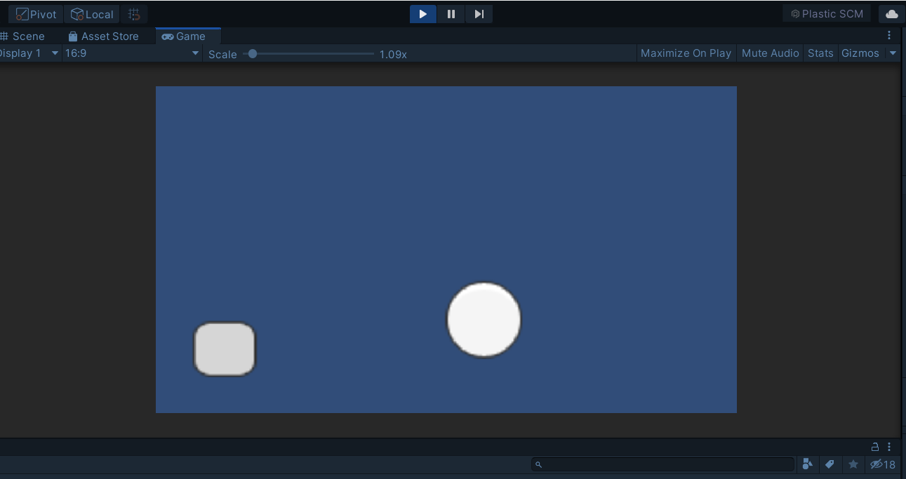
    
- In the game view, you cannot edit the entities.
- The game view is used to test the application in unity.
- Use the ‘Play/Pause/ Step’ Toolbar options to test it.
    
    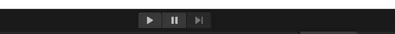
    

<aside>

> 💡 🚀 **[Join Discord Server](https://discord.gg/J5zDscnzms) → Get your doubts solved by experts instantly**

</aside>

---

# 7. Hierarchy

- The Hierarchy section in Unity is where all the Game objects(cameras, sprites, managers(UI, Audio, etc.), lights) used in the scene are visible.
- Hierarchy makes it easy for sorting game objects or club them together in a parent object. It is also easy for removing and add game objects from Hierarchy rather than the Scene view.
- You can press Ctrl + 4 to open the Hierarchy window.

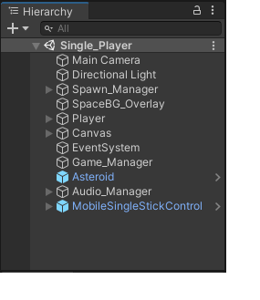

<aside>

> 💡 🚀 **[Join Discord Server](https://discord.gg/J5zDscnzms) → Get your doubts solved by experts instantly**

</aside>

---

# 8. Project Panel

- The Project Panel window displays all the files and folders we have included in our project. Every file that we use in our project can be navigated through the Project Panel.
- We can get a more detailed view of the Project Panel by clicking on the context button which is on the top-right of the window and selecting **One column Layout** or **Two-column Layout**.
- We can use Ctrl + 9 to open the Project Panel window.

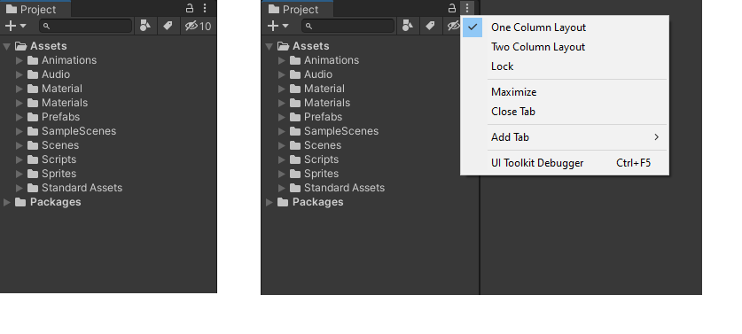

<aside>

> 💡 🚀 **[Join Discord Server](https://discord.gg/J5zDscnzms) → Get your doubts solved by experts instantly**

</aside>

---

# 9. Console

- The console is the Window where you can find all the Warnings, Errors & other messages that are generally generated by Unity itself.
- If you are building your own Project and in your Script and if there is any Error or Message that you wanted to Print at Runtime, that Time you can check via Console window for more information
- To Open Console window from Unity Main Menu, Select Window → General → Console
    
    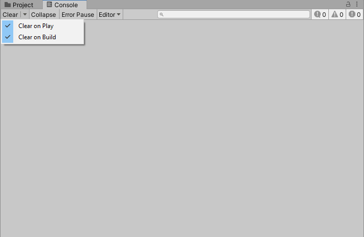
    
- You can also show your own messages in the Console using the Debug class.
- Everything that is written to the **Console Window** (by Unity, or your own code) is also written to a Log File.
- The Console **toolbar** has options for controlling how messages are displayed, and for searching and filtering messages
- The detail area shows the full text of the selected messages
- The Console window menu has options for opening Log files, controlling how much of each message is visible in the list, and setting stack trace options
- The Console list displays an entry for each logged message

<aside>

> 💡 🚀 **[Join Discord Server](https://discord.gg/J5zDscnzms) → Get your doubts solved by experts instantly**

</aside>

---

# 10. Components

- Every game object has different components depending upon the type of game object we have created. Components in a game object allow us to perform certain actions with our game object during the scene. Some of the highly used components have been mentioned below:
    - Transform: It is one of the main components of a game object. We cannot remove a transform component from our game object, every game object has a transform component. There are 3 sub-components under the transform component which are Position - it helps in updating positions of game objects in respective axes depending on the type of game(3D or 2D).
    Rotation - it helps in updating rotations of the game object.
    Scale - it helps in changing the size of the game object in the respective axes.
    - Rigidbody: What is the use of a game if we are not able to make our player Jump, run or move our player in a certain way?? 🤔 That’s what the Rigidbody component is here for. Rigidbody allows us to add physics to our game object to make it more realistic.
    - Collider: Ever wondered how a player can stand on the ground in the game and not go past right through it?? 🤔 That’s because we have a collider attached to every game object that doesn’t allow them to pass through the ground and let them stand on the ground.
    - Script: Scripts are mostly used to write the code for the game we create. But what code do we write? Say, you want the player to input the RIGHT Arrow ➡️ key from the keyboard and the game object would move from left to right. How would you make that happen in a game? Take a pause and think for a while. If you’ve not got the answer then here is one for you. You do that by coding it in scripts. Of course, we will discuss scripts in detail later on.
    - These are some of the main components that are highly used for game dev. Other components include animator, audio listener, sprite renderer, etc. which you can explore and play around with once you have started learning unity.
    
    <aside>

    > 💡 🚀 **[Join Discord Server](https://discord.gg/J5zDscnzms) → Get your doubts solved by experts instantly**
    
    </aside>

---

# 11. Inspector

- **Inspector Window** is used to modify the components of the game object that’s used to create a video game.
- When you open an empty project, at the very beginning you will see a blank inspector window on the right of the editor. *If you don’t see any inspector window floating on your editor then do the following: 👇*
    - From the menu, select **Windows > General > Inspector.**
        
        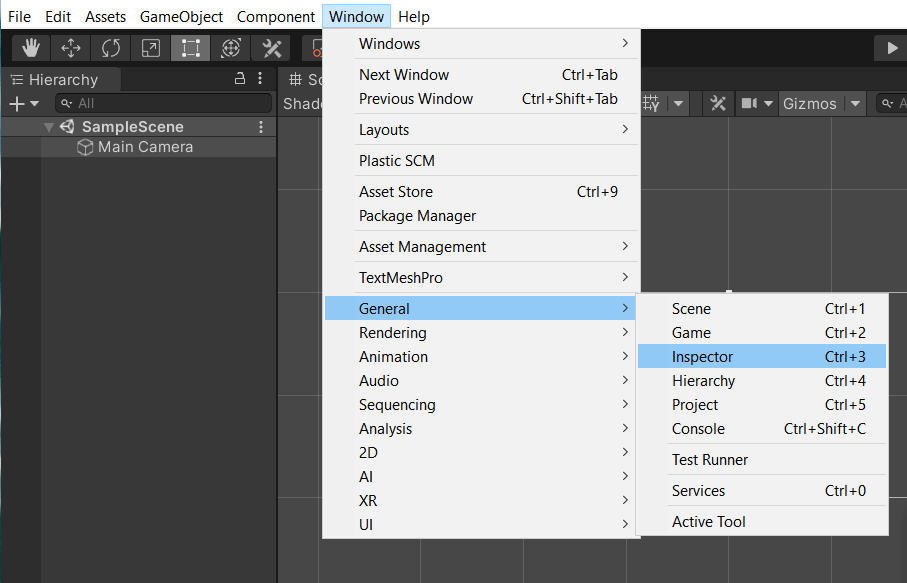
        
- Click the *Main Camera* from the Hierarchy Window and you will see its properties in the inspector.
- *Main Camera* is actually a *game object* in Unity. Hence, you can customize its properties i.e., enabling/disabling the game object, changing its position, color, size, projection, and many more.
    
    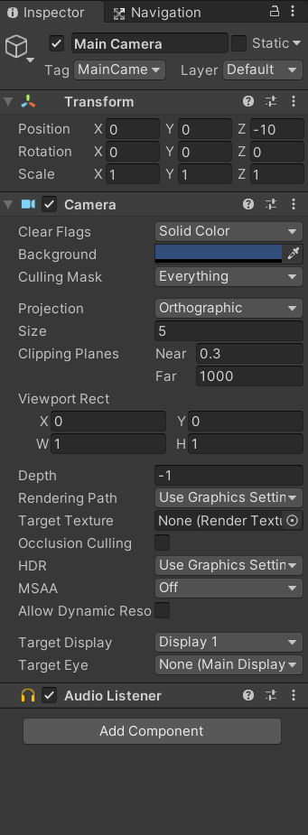
    
- *Recommended: 🔴 Play around with these values to get comfortable with the **Inspector.***

<aside>

> 💡 🚀 **[Join Discord Server](https://discord.gg/J5zDscnzms) → Get your doubts solved by experts instantly**

</aside>

---

*These are the things you all need to know about while getting started with Unity. You are good to go for the next part of the course. All the best!!😃*

<aside>

> 💡 Now you reached the end of chapter one. Now share with the world and start earning reward points. 
> 1. Log in to LinkedIn.
> 2. Create a post.
> 3. Start a post a short update on LinkedIn about, what you have learned so far
> 4. Tag Outscal and your newly made connections in the post so the team will get notified every time. Use **#30DaysGameDevChallenge and #outscal** in the post.
> 5. Submit the LinkedIn post link via this form [https://airtable.com/shrXGSkgf5NClpoIU](https://airtable.com/shrXGSkgf5NClpoIU)

</aside>

 

<aside>

> 💡 In this chapter, you can create two submissions.
> 1. submission = 50 points
> 2. submissions = 100 points
>> 500 points = Outscal Branded T-shirt 👕

</aside>

<aside>

> 💡 **[⏭ Next Chapter - MVC and Design Patterns](https://www.notion.so/MVC-Design-Patterns-in-Unity-a0cdd24d2b7341d4ae51017fd946f238)**

</aside>

---
